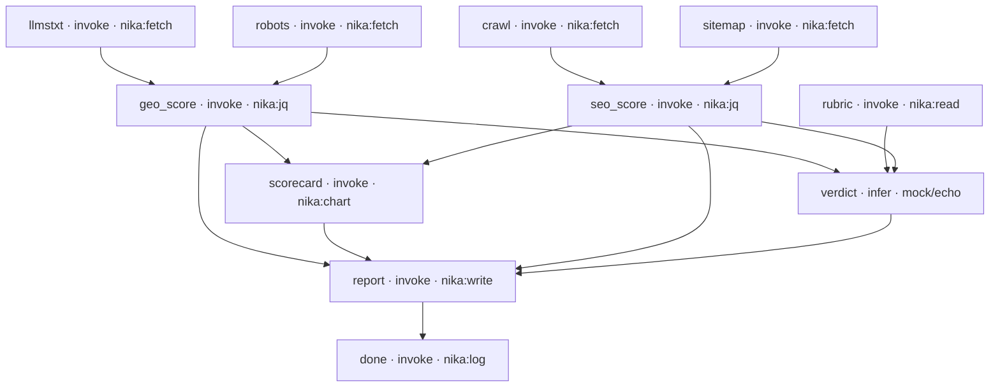

<p align="center">
  <a href="https://nika.sh">
    <picture>
      <source media="(prefers-color-scheme: dark)" srcset="https://nika.sh/brand/nika-logo-dark.svg">
      
    </picture>
  </a>
</p>

<h1 align="center">nika-site-audit</h1>

<p align="center"><strong>A full SEO + GEO site audit as one workflow file.</strong><br>
Discover, crawl bounded, score deterministically, one narrated verdict,
artifacts as receipts. Checked before a single request leaves your machine.</p>

## The whole audit, drawn by nika itself

This diagram is generated by `nika graph site-audit.nika.yaml --format mermaid`,
not drawn by hand. Eleven tasks, five waves:



One model call in the whole pipeline (`verdict`). Everything else is
deterministic: fetches, jq scoring, a chart, a report. That is the point.

## Quick start

```bash
brew install supernovae-st/tap/nika     # single binary

nika check site-audit.nika.yaml         # the audit BEFORE the audit:
                                        # plan · cost floor · permits · secret flows
nika run  site-audit.nika.yaml          # offline verdict (mock model) · artifacts in out/
nika test site-audit.nika.yaml          # the committed golden guards the outputs
```

Live run against your own site, with a real model:

```bash
nika run site-audit.nika.yaml \
  -i "url=https://your-site.com" \
  --model anthropic/claude-sonnet-4-6   # or any provider/model, incl. ollama/...
```

Note the `permits:` block in the workflow pins the network to the audited
host. Widen it when you change `vars.url`; everything else stays default-deny.

## What it does

| Wave | Tasks | What happens |
|---|---|---|
| 1 | `robots` `llmstxt` `sitemap` `crawl` `rubric` | GEO discovery in parallel: robots.txt, llms.txt, sitemap.xml, plus a bounded same-origin crawl (8 pages, robots respected). A missing file is a finding, not a crash |
| 2 | `geo_score` `seo_score` | deterministic scoring in jq: AI-crawler access, llms.txt presence, titles, canonicals, status codes |
| 3 | `scorecard` `verdict` | a chart artifact from the scores, and the one LLM call: the narrated verdict, grounded in the rubric |
| 4-5 | `report` `done` | everything folds into `out/report.html` + `out/scorecard.svg` |

Every run writes a hash-chained trace. `nika trace verify` exits 0 or names
the first broken link: the receipt comes from the runtime, not from the
model's prose.

## Why this shape

The interesting failures in an audit pipeline happen before the model is
called: a crawl that hammers a site, a secret that leaks into a prompt, a
cost that surprises you. `nika check` catches those statically, and the
`permits:` boundary makes the blast radius readable in the file itself.
The model gets exactly one job: narrate the verdict from scores computed
deterministically.

## The 2024 legacy showcase

`legacy/site-audit-v10.nika.yaml` preserves the original 1072-line pipeline:
50 tasks, 22 layers, locale detection across 38 locales, an interactive
10-tab dashboard, AI-generated imagery and a podcast narration. It ran
against the pre-rewrite `nikab` binary in the retired pre-v1 dialect and
does not parse on current engines, by design. Recorded legacy-era results:

| Site | Pages | Locales | Tasks |
|------|-------|---------|-------|
| qrcode-ai.com | 1,654 | 38 | 50/50 |
| htmx.org | 278 | 1 | 50/50 |
| tailwindcss.com | ~1,900 | 1 | 50/50 |

Keep it as evidence of scale and a design archive. Do not learn the syntax
from it; the current language is the [public spec](https://github.com/supernovae-st/nika-spec).

## Files

| File | What it is |
|---|---|
| `site-audit.nika.yaml` | the v1 workflow: 11 tasks, declared permits, offline by default |
| `site-audit.nika.yaml.golden.json` | the committed golden: `nika test` compares typed outputs against it |
| `skills/` | the audit rubric the verdict is grounded in |
| `legacy/` | the 2024 showcase, read-only |
| `prototypes/` | exploration, not the product |

<p align="center">
  <sub>Docs: <a href="https://docs.nika.sh">docs.nika.sh</a> · Engine (AGPL-3.0): <a href="https://github.com/supernovae-st/nika">nika</a> · Templates: <a href="https://github.com/supernovae-st/nika-starter">nika-starter</a> · <a href="https://github.com/supernovae-st/nika-actions-starter">nika-actions-starter</a></sub>
</p>
